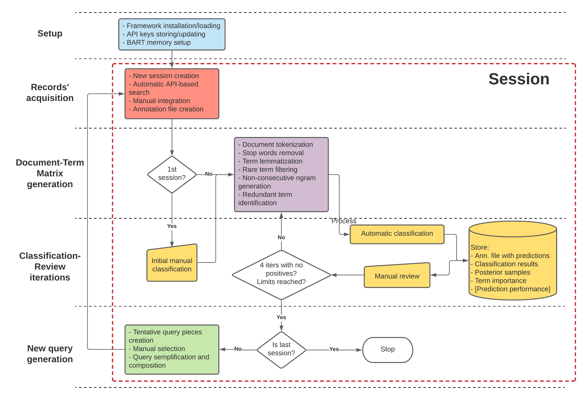

Methods
================
2021-09-21

## Methods

### General description

We built an R (R Core Team, 2020) based framework with the goal of
simplifying two aspects of systematic reviews: record acquisition and
classification. The framework is composed of several components which
act together while being independent enough to be in principle be
substituted by alternative implementations, given that the structure of
the intermediate data outputs is respected. See Supplemental Material S1
for an in-depth description of the framework and how to use it.  
The tasks carried out by the framework are grouped into “sessions,” that
is, a set of actions that starts from using a search query to obtain a
set of scientific publications (records), which will be eventually
labelled as relevant (“positive” in the rest of the text) or not
(“negative”) for the topic of interest (Fig. 1). From this labelled set,
the framework allows to generate a new query and perform a new
session.  
The researcher should use the framework with a specific query from which
she expects a high relevant/non-relevant record ratio.  
Follows a description of the framework’s components.  

Figure 1.Framework’s visual depiction.

<!--  -->

### Record’s acquisition and initial labelling

We built a set of tools to let users automatically search and download
records data from three major scientific databases (“sources”): MEDLINE
(<https://pubmed.ncbi.nlm.nih.gov/>), Web Of Science (WOS,
<https://apps.webofknowledge.com/>) and the Institute of Electrical and
Electronics Engineers (IEEE,
<https://ieeexplore.ieee.org/Xplore/home.jsp>). The user needs to input
a search query and a date range. The query may contain boolean operators
AND, OR, NOT and nested parentheses.  
For WOS, an Application Programming Interface (API) key is necessary to
use the automatic search tools; for IEEE, if an API key is not
available, a slower, web scraping-based solution will be employed; for
MEDLINE, an API key is required only for high-frequency requests to the
NCBI server (Sayers, 2010), or if a large number of records is expected
since our tool splits big API requests in multiple smaller ones.  
It is also possible to download and import records in the framework
manually. This is particularly useful to acquire records from the SCOPUS
(<https://www.scopus.com/search/form.uri?display=basic#basic>) and
EMBASE databases (<https://www.embase.com/#advancedSearch/default>), for
which a comprehensive API interface was not easy to build. A short guide
on how to set up the framework for each supported database is available
in Supplemental Material S3.  
Once the records are downloaded and acquired, the framework merges them
into a single database, resolving duplicates and different formatting
between sources. The records are ordered according to the frequency of
the positive terms (e.g., not preceded by a *N**O**T* modifier) of the
query appear in the title and abstract (“simple ordering”); this
approach is a modification of Wallace et al. (2010). The final output is
an “Annotation file” with all the record’s info and its label when
present´.  

A first initial set of manually labelled records is needed to start the
automatic classification. We suggest manually label the first 250
records (see “hyperparameter optimization” later).  

### Document-Term matrix generation

The annotation file produced in the previous step has a number of fields
characterizing a scientific publication. The framework models the
relevance of a record based on the following fields: title, abstract,
authors, keywords, MESH terms (Lipscomb, 2000). A series of Natural
Language Processing (NLP) techniques (Ananiadou & McNaught, 2006;
Marshall & Brereton, 2015) are employed to transform the textual
information in these fields into features for machine learning, through
a bag-of-words approach (Marshall & Brereton, 2015). The processing of
free text fields includes tokenization (i.e., extracting the terms),
common stopwords (i.e. sentence components bringing no meaning) removal,
part-of-speech filtering (only nouns, adjectives, verbs and untagged
terms are retained), and lemmatization of the terms (i.e. reduction to
their base grammar form). Processing for authors, keywords and MESH
terms identify logical units (e.g., author’s full names, composite
keywords) without breaking them into single terms, and no stopwords
removal or lemmatization are applied.  
To reduce noise and save computation time, terms that appeared in less
than 5% of the labelled documents (positive and negatives) are removed
from negative records. All terms in the positive set are kept to
increase sensitivity at the cost of specificity.  
Some terms tend to co-appear in records (non-consecutive ngrams,
nc-ngrams), often carrying a particular meaning when copresent. To
detect nc-ngrams, we generated a network representation posing edges
between terms with a cosine similarity in terms of records copresence
&gt; 0.5. We extracted the maximal cliques in the network (Eppstein et
al., 2010) representing highly correlated groups of terms; These
generated terms are added to the data set. To avoid overfitting, we kept
nc-ngrams of a maximum of ten terms.  
A similarity network is built again using a similarity threshold of 0.9
and finding the cliques again. In this case, the cliques represent terms
that always appear together and therefore can be considered synonyms.
These terms are merged in the data set to increase computation
efficiency and reduce overfitting.  
The final output is a matrix, also called a Document-Term Matrix (DTM),
with *N**d* rows representing the records *D*,
*N**t* terms column for the *t**f**i**e**l**d*
terms (divided by record field) and 0, 1 values whether
*t**f**i**e**l**d* ∈ *D*. We also enriched the DTM with
features storing the number of terms in each field to help the model
scale term importance based on the document length.

### Label prediction

We used a Bayesian Additive Regression Trees (BART) machine learning
model (Chipman et al., 2010) (in the implementation of Kapelner &
Bleich, 2013) to predict the probability of a record of being relevant,
given the information coded into the enriched DTM. BART models have
several advantages: as other boosted trees techniques (Hastie et al.,
2009), they can model complex non-linearities, perform variable
selection, manage missing data while sporting high performance in
predictive power. However, the Bayesian framework they are built on
provides further benefits: less sensitivity on hyperparameter choices,
natural regularization, and, most of all, predictive distributions as
output in place of point-wise predictions.  
We set up the BART model to use 2000 iterations (after 250 burn-in
iterations) and 50 trees; we used a *k* value of 2 to regularized
extreme prediction and let the model use missing fields in the DTM as
features (Kapelner & Bleich, 2015). Since the goal is to find all
positive matches (i.e., focus on sensitivity), positive records are
oversampled ten times.  
The output is a posterior predictive distribution (PPD) of each record’s
probability of a positive match. An ensemble of ten models was fitted to
improve prediction stability by averaging the predictions between
models.  
To choose how to label a record, we exploit the uncertainty typical of
Bayesian estimates to decide a record label and whether it requires
manual evaluation, an approach joining the “uncertainty” and “certainty”
selection criteria of previous work in the field (Miwa et al., 2014). To
describe the process formally, we define

$$\\pi\_i = \\frac{1}{M}\\sum\_mPr(L\_i = \\text{pos}\|DTM,model\_m)$$

as the PPD of a record *D**i* being assigned a positive label
(*L**i*), averaging the PPDs of the ensemble of *M* = 10
models, and

$$\\pi\_{i,l} = \\{\\pi\_i : Pr(\\pi\_i) = 1\\%\\}\\\\
\\pi\_{i,u} = \\{\\pi\_i : Pr(\\pi\_i) = 99\\%\\}$$

as respectively the lower and upper boundaries of the 98% quantile
interval of *π**i* (98% predictive interval, 98% PrI).  
Then we identify the “uncertainty zone”

*U**π* = \[max*D**i* ∈ *L**n**π**i*, *u*, min*D**i* ∈ *L**p**π**i*, *l*\]

that is, a range of *π* values between the smallest
*π**i*, *l* in the set of already labelled positive records
*L**p* and the largest *p**i**i*, *u* related to
the negative ones *L**n*, noting that the two limits can
appear in any order.  
Consequently, a record *D**i* will be labelled as positive if

*π**i*, *l* &gt; max*π* ∈ *U**π**π*

that is, its lower 98% PrI boundary should be higher than every value in
the uncertainty zone. In other words, for a record to be labelled
positive, its PPD should be within the range of the mixture of PPD of
the previously labelled positive records and not cross the distributions
of the negative records.  
Conversely, a record is labelled as negative if

*π**i*, *u* &gt; min*π* ∈ *U**π**π*

All other records are labelled as uncertain and will require manual
labelling. Also, positive labelled records are to be reviewed to avoid
false positives. Furthermore, if a predicted label differs from the
existing one, a manual check will be required; this could identify
uncertainty in the labelling criteria of the same researcher or between
different researchers.

The automatic classification task and the manual review step form an
iterative loop (CR iterations). The whole algorithm falls in the pattern
defined as active machine learning Miwa et al. (2014), with the machine
querying the user to address and progressively resolve uncertainty in
the classification.  
The CR iterations continue until no new positive matches are found in
four consecutive iterations. The framework supports alternative stopping
conditions like limits on the fraction or number of total records
reviewed and on the total number of positive matches found.

### New search query generation

We created an algorithm that helps create a new search query that could
detect further relevant publications missed during the first search,
possibly at a reasonable cost in specificity (i.e., a higher number of
negative results).  
The algorithm encompasses a number of steps:

-   We fit a partition tree (Therneau & Atkinson, 2019) between the DTM
    and 800 samples from the PPD; if a term is present multiple times in
    the DTM (e.g. both title and abstract), they are counted just one,
    and field term count features are removed. This step generates a
    list of rules composed by *A**N**D*/*N**O**T* “conditions” made of
    terms/authors/keywords/MESH, which together identify a group of
    records.
-   For each rule, we add a set of negative conditions (*N**O**T*
    statements in the rule), removing non-relevant records in a group: a
    condition removing the largest number of non-relevant records is
    found, and then iteratively, more are added with the same logic,
    until no conditions are found that would not also remove positive
    records.
-   The extended set of rules is sorted by the difference between the
    number of positive and negative records they identify in descending
    order. Given this ordered list, the cumulative number of unique
    positive records is computed and used to group the rules: each rule
    in the same group of rules adds the same number of positive records
    to the preceding group but are ordered according to the number of
    negative records they identify.
-   These groups of rules are outputted, and the researcher is asked to
    review them, selecting one or more (useful if they convey radically
    different meaning) rules from each group, or edit them (in case too
    specific positive or negative conditions were included). By default,
    the framework suggests keeping the first rule of each group since it
    would identify the lower number of non-relevant records for the same
    number of positive one (.e., higher specificity). It is possible to
    exclude a group of rules altogether, especially the last ones with
    very low positive/negative records ratios.
-   The selected rules are joined together by *O**R* statements,
    defining a subset of records with a sensibly higher proportion of
    positive records than the original one.
-   Given this data set, the next step removes redundant rules (i.e.,
    rules whose positive records are already included in more specific
    ones) and conditions (i.e., conditions that once removed do not
    decrease the total number of positive or do not increase the
    negative records).
-   Finally, the rules are re-elaborated in a format usable on the major
    scientific databases.

It is important to note that this process is entirely data-driven. The
algorithm is only aware of the “world” defined by the data set, itself
generated by a specific search query focused on a particular topic.
Therefore, the new query may not be specific once applied to an
unbounded search domain, returning an unmanageable amount of unrelated
results. We suggest extending the query by adding domain-specific terms
linked by an *A**N**D* statement, separating the original query and the
new addendum in two distinct logical blocks by enclosing them in
parentheses. See the Results for the specific query used in the second
session. <mark>*not sure whether to put this part here or in the
discussion*</mark>

### Hyperparameter search

The machine learning model behind the algorithm has a number of
hyperparameters in addition to the BART specific ones: the number of
ensemble models, the source of randomness between models (just derived
from MCMC sampling, the default, or whether to bootstrap the data
first), the oversampling of positive records, the PrI quantiles, the
number of initial manually labelled records. These parameters have a
relevant effect on the algorithm performance.  
We set up a grid search to evaluate the parameters on a subset made of
the first 1200 records from the first session; these records were fully
labelled as relevant or not. We run the framework for each combination
of parameter values, automatizing the manual review part using the
already collected labels. The framework ran until four CR iterations
with no positive records were returned, or the whole dataset was
labelled.  
For each combination, a performance score was computed as the product of
*Efficiency* (1 minus the number of records that required review over
the total) and *Sensitivity* (number of positive records found over the
total of positives). We then identified homogeneous “performance
clusters” of parameter values using a decision tree on the score. For
the final analysis, we chose the best cluster of parameter value
combinations and, inside the cluster, the best combination in order of
Sensitivity and Efficiency.

### Performance evaluation

It is hard to estimate the generalized performance of such a model since
the data is not a random sample (the records are presumably the whole
population of articles from the searched databases for those search
criteria), and since the order of records matters (it drives the choice
of the initial labelling set). Therefore we postulated that usual random
train/test methods to estimate the out-of-sample machine learning
performance (Kohavi & others, 1995) would not be representative in this
situation. Also, common time-series based predictive performance
methodologies would reveal inadequate (Tashman, 2000) since the expected
proportion of positive matches is not constant throughout the data set
and is expected to fall fast as the first matches are found.  
Our solution was to use Bayesian logistic regression to model the label
of the manually reviewed records on the lower bound of the \[98% PrI\]
produced by our algorithm. For the model we used weakly regularizing,
robust priors for the intercept (Student T with
*ν* = 3, *μ* = 0, *σ* = 2.5) and the linear coefficient (Student T with
*ν* = 3, *μ* = 0, *σ* = 1.5). The goal of the model is to estimate the
PPD of the missed number of positive matches in the whole data set.
Given that this model is conditional only on the BART predictions and
not on the DTM, it is characterized by more uncertainty, providing a
plausible worst-case scenario. The quality of the model was evaluated
through Bayesian *R*2 (Gelman et al., 2019) of which we
reported the posterior median and 90% Credible Interval \[90% CrI\].  
The predictive distribution of the number of missed positive records
allows to estimate the expected long-run *Sensitivity* and the *Work
saved over random* (WSoR) of the algorithm. The WSoR is based on a
negative hypergeometric model to estimate the number of records to
manually label to find the same number of positives if records were
evaluated in random order (Chae, 1993); the WSoR is then one minus the
ratio of the reviewed records over this number. For the number of
predicted positive records, the sensitivity and WSoR, we reported the
truncated 90% PrI \[trunc. 90% PrI\], which is the uncertainty interval
bounded at the number of observed total positive records: since each
positive match is manually verified, the probability of a number of
total positive records lower than observed is zero.

Ananiadou, S., & McNaught, J. (2006). *Text mining for biology and
biomedicine*. Citeseer.

Chae, K.-C. (1993). Presenting the negative hypergeometric distribution
to the introductory statistics courses. *International Journal of
Mathematical Education in Science and Technology*, *24*(4), 523–526.

Chipman, H. A., George, E. I., McCulloch, R. E., & others. (2010). BART:
Bayesian additive regression trees. *The Annals of Applied Statistics*,
*4*(1), 266–298.

Eppstein, D., Löffler, M., & Strash, D. (2010). Listing all maximal
cliques in sparse graphs in near-optimal time. *International Symposium
on Algorithms and Computation*, 403–414.

Gelman, A., Goodrich, B., Gabry, J., & Vehtari, A. (2019). R-squared for
bayesian regression models. *The American Statistician*.

Hastie, T., Tibshirani, R., & Friedman, J. (2009). Boosting and additive
trees. In *The elements of statistical learning* (pp. 337–387).
Springer.

Kapelner, A., & Bleich, J. (2013). bartMachine: Machine learning with
bayesian additive regression trees. *arXiv Preprint arXiv:1312.2171*.

Kapelner, A., & Bleich, J. (2015). Prediction with missing data via
bayesian additive regression trees. *Canadian Journal of Statistics*,
*43*(2), 224–239.

Kohavi, R., & others. (1995). A study of cross-validation and bootstrap
for accuracy estimation and model selection. *Ijcai*, *14*, 1137–1145.

Lipscomb, C. E. (2000). Medical subject headings (MeSH). *Bulletin of
the Medical Library Association*, *88*(3), 265.

Marshall, C., & Brereton, P. (2015). Systematic review toolbox: A
catalogue of tools to support systematic reviews. *Proceedings of the
19th International Conference on Evaluation and Assessment in Software
Engineering*, 1–6.

Miwa, M., Thomas, J., O’Mara-Eves, A., & Ananiadou, S. (2014). Reducing
systematic review workload through certainty-based screening. *Journal
of Biomedical Informatics*, *51*, 242–253.

R Core Team. (2020). *R: A language and environment for statistical
computing*. R Foundation for Statistical Computing.
<https://www.R-project.org/>

Sayers, E. (2010). A general introduction to the e-utilities. *Entrez
Programming Utilities Help \[Internet\]. Bethesda (MD): National Center
for Biotechnology Information (US)*.

Settles, B. (2009). *Active learning literature survey*.

Tashman, L. J. (2000). Out-of-sample tests of forecasting accuracy: An
analysis and review. *International Journal of Forecasting*, *16*(4),
437–450.

Therneau, T., & Atkinson, B. (2019). *Rpart: Recursive partitioning and
regression trees*. <https://CRAN.R-project.org/package=rpart>

Wallace, B. C., Small, K., Brodley, C. E., & Trikalinos, T. A. (2010).
Active learning for biomedical citation screening. *Proceedings of the
16th ACM SIGKDD International Conference on Knowledge Discovery and Data
Mining*, 173–182.

